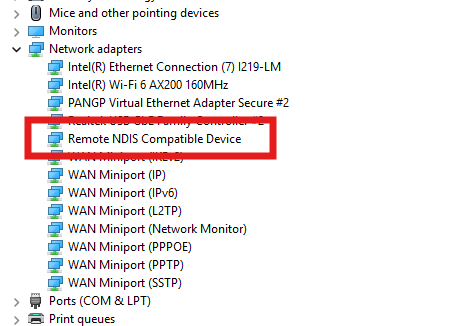
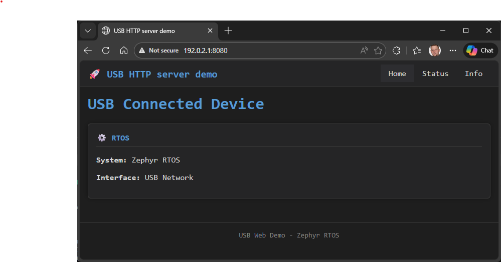

# Microcontroller USB Web Configuration Demo

This project demonstrates an HTTP web server running on a Zephyr-supported microcontroller over USB connection. The device appears as an Ethernet device to the host, supporting both **Linux (CDC ECM)** and **Windows (RNDIS)** operating systems. The application provides a modern web interface for configuring device parameters such as WiFi settings and network configuration.

**Key Features:**
- Generic microcontroller with USB network interface (CDC ECM for Linux, RNDIS for Windows)
- HTTP web server accessible at `http://192.0.2.1:8080`
- Modern web interface for device configuration
- WiFi and network settings configuration examples
- Automatic DHCP server for Windows (192.0.2.100-192.0.2.150)
- Modular, well-documented architecture
- Clean separation between USB, network, and web server components
- Device status monitoring and information pages

# Prerequisites

* Create virtual environment (venv is created only once):
  
  ```console
  python3 -m venv ~/zephyrproject/.venv
  ```

* Activate virtual environment (activated when you start working):
  
  ```console
  source ~/zephyrproject/.venv/bin/activate
  ```

* USB cable connected to board
* Administrator access (Windows) or sudo privileges (Linux)

# Build and Flash

Replace `<your_board>` with your Zephyr-supported board.

## Build for Linux (CDC ECM - Default)

```console
cd ~/zephyrproject/zephyr
west build -p always -b <your_board> /zephyrproject/app_h723_ethusb
west flash
```

## Build for Windows (RNDIS)

```console
cd ~/zephyrproject/zephyr

west build -p always -b <your_board> -S=prj-rndis.conf /zephyrproject/app_h723_ethusb
west flash
```

## Alternative Build Configurations

```
# Wired Ethernet (if board has Ethernet port)
west build -p always -b <your_board> -S=prj-eth.conf ../../zephyrtrain/24_Ethernet/usb_ethernet
```

# Tested Board

| Device              |
| ------------------- |
| nucleo_h723zg       |

Many other boards with USB support are available, but not tested.

# Usage

## Quick Start - Linux

```bash
# 1. Find USB interface
ip link

# 2. Configure interface (replace enxXXXXXXXXXXXX with your interface)
sudo ip link set enxXXXXXXXXXXXX up
sudo ip addr add 192.0.2.2/24 dev enxXXXXXXXXXXXX

# 3. Access web server
curl http://192.0.2.1:8080
```

## Quick Start - Windows

### Windows Device Manager - USB Ethernet Device

When the USB device is properly connected and recognized on Windows, it appears in Device Manager as shown below:



The device should appear under **Network adapters** as "USB Ethernet/RNDIS Gadget" and should not show any error indicators.

### Web Server Home Page

Once connected and configured, the web server can be accessed at `http://192.0.2.1:8080`. Here's an example of the home page:



The page displays device information and connection status, confirming that the HTTP server is running and accessible.

## Network Configuration

### Device Configuration

| Setting | Value |
|---------|-------|
| **Device IP** | 192.0.2.1 |
| **Web Server Port** | 8080 |
| **Network** | 192.0.2.0/24 (Class E, TEST-NET-3) |

### Linux Host (CDC ECM)
- **Host IP**: 192.0.2.2 (manual)
- **Netmask**: 255.255.255.0 (/24)
- **Configuration**: Manual `ip addr add`

### Windows Host (RNDIS)
- **Host IP**: 192.0.2.100-192.0.2.150 (DHCP)
- **Netmask**: 255.255.255.0 (/24)
- **Configuration**: Automatic (device provides DHCP)

## Verification

```console
# Test connectivity
ping 192.0.2.1

# Test web server
curl http://192.0.2.1:8080

# Or open in browser
http://192.0.2.1:8080
```

# Configuration Options

The project includes multiple configuration files for different use cases:

| File | Mode | Protocol | Best For | Setup |
|------|------|----------|----------|-------|
| `prj.conf` | CDC ECM | Ethernet Control Model | Linux | Manual |
| `prj-rndis.conf` | RNDIS | Remote Network Driver Interface | Windows | DHCP (Automatic) |
| `prj-eth.conf` | Ethernet | Wired Ethernet | Boards with Ethernet port | Manual |


## Platform Strategy

- **Use CDC ECM (prj.conf)** for Linux development
- **Use RNDIS (prj-rndis.conf)** for Windows development

# Show Content via Debug Serial Port Output

Connect to the microcontroller's serial port to view logs:

```log
*** Booting Zephyr OS build v4.x.x ***
[00:00:00.000,000] <inf> usb_service: USB device initialized
[00:00:00.100,000] <inf> usb_service: USB ECM interface found at index 2
[00:00:00.150,000] <inf> usb_service: IPv4 address 192.0.2.1/24 configured
[00:00:00.200,000] <inf> usb_service: DHCP server started
[00:00:00.250,000] <inf> web_server: HTTP server started on port 8080
[00:00:00.300,000] <inf> main_app: Ready for connections on http://192.0.2.1:8080
```

**Linux serial connection:**
```bash
picocom -b 115200 /dev/ttyACM0
```

**Windows PowerShell:**
```powershell
$port = New-Object System.IO.Ports.SerialPort "COM3", 115200
$port.Open()
while ($port.IsOpen) { Write-Host $port.ReadLine() }
```

# Project Structure

```
.
├── src/
│   ├── main.c              # Main application entry point
│   ├── usb_service.c       # USB device initialization
│   ├── usb_service.h       # USB service interface
│   ├── web_server.c        # HTTP server implementation
│   ├── web_server.h        # HTTP server interface
│   └── web_resources.h     # HTML pages (customizable)
├── boards/
│   └── (device tree overlays if needed)
├── prj.conf                # CDC ECM configuration (Linux)
├── prj-rndis.conf          # RNDIS configuration (Windows)
├── prj-eth.conf            # Wired Ethernet configuration
├── CMakeLists.txt          # Build configuration
└── README.md               # This file
```

## Usage

### Monitor Serial Output

Open a terminal to monitor the application logs:
## Windows

```powershell
#powershell
$port = New-Object System.IO.Ports.SerialPort "COM3", 115200
$port.Open()
while ($port.IsOpen) { Write-Host $port.ReadLine() }
```

## Linux

```console
sudo picocom -b 115200 /dev/ttyACM0
```


Example of Serial output (RNDIS):

```log
*** Booting Zephyr OS build v4.3.0-5207-g1e03ea8ff7fe ***
[00:00:00.051,000] <inf> net_config: Initializing network
[00:00:00.051,000] <inf> net_config: Waiting interface 1 (0x2400152c) to be up...
[00:00:30.052,000] <inf> net_config: IPv4 address: 192.0.2.1
[00:00:30.052,000] <err> net_config: Timeout while waiting network interface
[00:00:30.052,000] <err> net_config: Network initialization failed (-115)
[00:00:30.052,000] <inf> main_app: === Zephyr USB ECM Web Server Application ===
[00:00:30.062,000] <inf> usb_service: USB device initialized
[00:00:32.062,000] <inf> usb_service: USB ECM interface found at index 2
[00:00:32.062,000] <inf> usb_service: IPv4 address 192.0.2.1/24 configured on USB interface
[00:00:32.062,000] <inf> usb_service: DHCP server started at 192.0.2.1, pool 192.0.2.100-192.0.2.150
[00:00:32.062,000] <inf> main_app: USB ECM service initialized
[00:00:32.062,000] <inf> main_app: Web server started
[00:00:32.062,000] <inf> main_app: Ready for connections on http://192.0.2.1:8080
[00:00:32.062,000] <inf> web_server: HTTP server starting on port 8080...
[00:00:32.062,000] <inf> web_server: HTTP server listening on port 8080
[00:00:32.062,000] <inf> web_server: Open http://192.0.2.1:8080 in your browser
[00:00:42.062,000] <inf> main_app: System alive, uptime: 42 seconds
```

